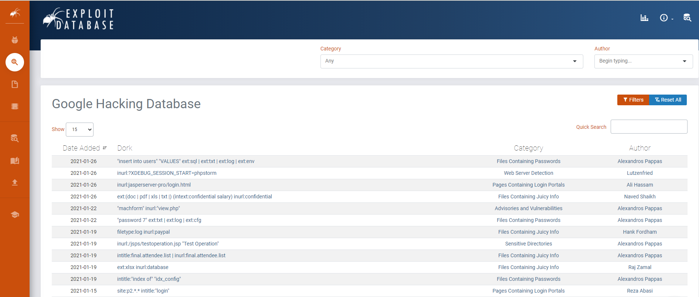
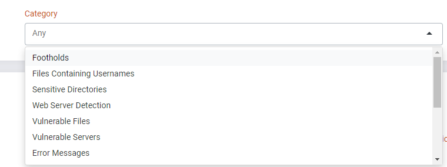
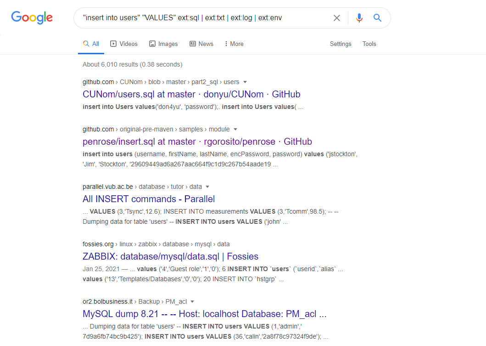
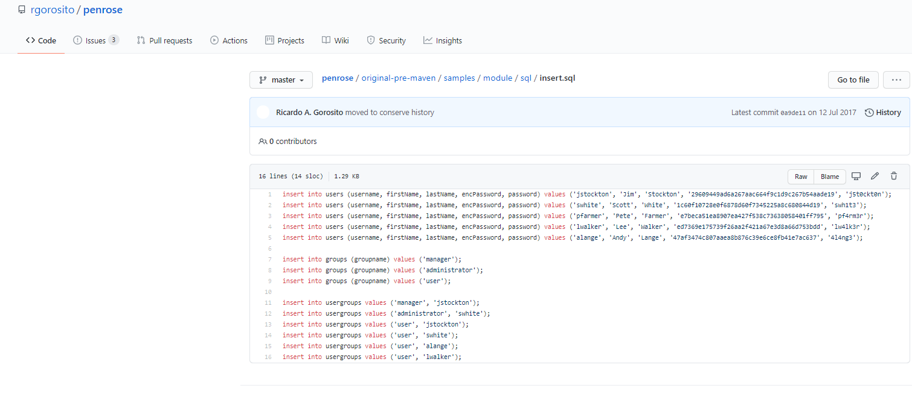
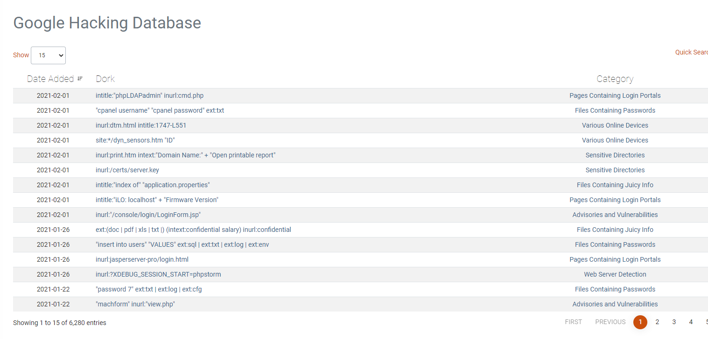

# Google

#### 简介

Google作为十分强大的搜索引擎，它能遍历到全球各地的可见网站，为了方便查找网站，还设有一个特殊的语法 **Google语法**,  对于安全圈，给它取名为 **Google Hack**。

这是因为在渗透的过程中，巧妙的使用 **Google Hack** 这样的搜索引擎，我们能快速找到目标的敏感信息泄露和渗透测试中的突破点。


#### 基础

我们从国外的一个知名网站 [Exploit-DataBase](https://www.exploit-db.com/) 来逐步了解 **Google Hack**

在网站中世界广大的黑客朋友们自发维护的一个汇集着各种已经被优化的查询语句的数据库，每天都在不断地更新，你可以在里面发现一些新的姿势或是一些新的渗透技巧

网站链接: https://www.exploit-db.com/google-hacking-database



我们通过它的语法分类来了解常见的搜索点



```
1.Footholds 						立足点            可帮助攻击者立足于Web服务器的查询语法
2.File Containing Usernames 		包含用户名的文件    搜索与账号密码有关的敏感文件
3.Sensitive Directorries 			敏感目录 		   找到一些特定的目录，例如后台或者下载目录
4.Web Server Detection 				易被攻击的Web服务 	 搜索显示具有特定漏洞或特定敏感文件的Web服务。
5.Vulnerable Files 					易被攻击的文件 	 查找可能出现漏洞的文件或者泄露信息的文件
6.Vulnerable Server 				出现漏洞的服务 	 通过特定Url搜寻出现漏洞的服务
7.Error Messages 					错误信息 		   查找Web服务的报错文件或者含有敏感内容的错误信息
8.Files Containing Juicy Info 		含有信息的文件 	 针对目标查找含有敏感信息的文件
9.Files Containing Passwords 		含有密码的文件      针对目标查找含有密码的文件
10.Sensitive Online Shopping Info 	与购物有关的信息    查找与购物数据有关的信息
11.Network or Vulnerability Data 	漏洞点查找 		  通过语法找到可以出现的漏洞点 
12.Pages Containing Login Portals 	登录页面 		   查找包含登录的页面
13.Various Online Devices			网络在线设备 		  查找网络中的在线设备，例如摄像头,打印机等
14.Advisories and Vulnerabilities 	建议与漏洞点	 	  根据语法找一些已经出现漏洞的Web服务
```

这里的分类主要明确了我们应当用这样的一个搜素引擎做哪些方面的信息收集，例如去寻找某目标的密码信息泄露或者后台登录站点

下面看一下常用的几个搜素词汇

```
1.intext	搜素匹配文本内容的网站
2.intitle   搜索匹配标题的网站
3.cache		搜索Google中某些内容的缓存
4.filetype  搜索匹配文件类型的网站
5.info		搜索指定站点的某些信息
6.inurl		搜索匹配URL某部分的网站
7.link		搜索某站点响应中的链接
8.site		搜索指定站点的网站
9.ext		搜索指定文件扩展名的网站
```

这里从 [Exploit-DataBase](https://www.exploit-db.com/)  中拿出几个语句举例子

#### 例子

 **inurl:https://trello.com AND intext:@163.com AND intext:password**


这里的搜索为在 trello平台中搜索使用网易邮箱注册并泄露密码的网页


成功登录网易邮箱


同样的方法可以使用在其他网站上


**"insert into users" "VALUES" ext:sql | ext:txt | ext:log | ext:env**



这里是通过关键字后缀和SQL语句来搜寻含有关键字的站点



其他的大家就根据这个谷歌语句集合库和想象力来构造语句来信息挖掘吧

