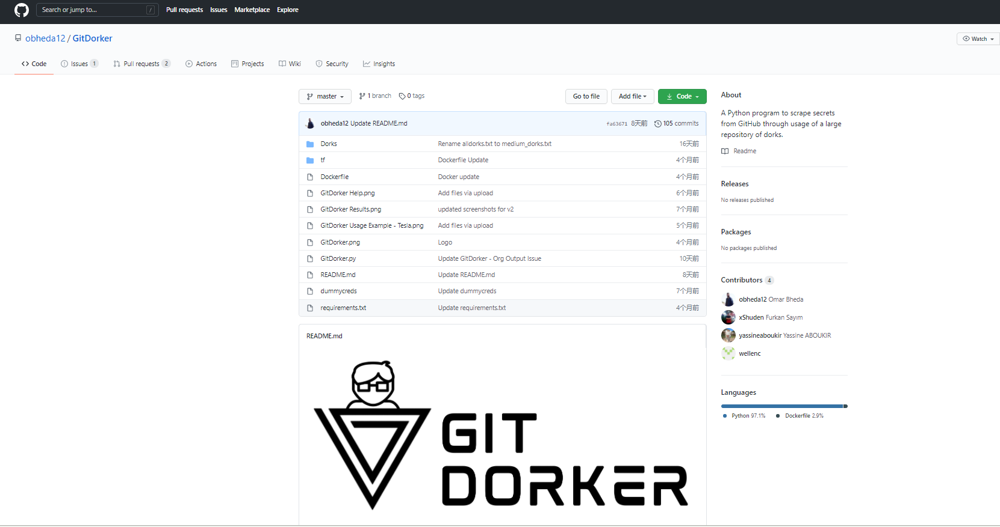
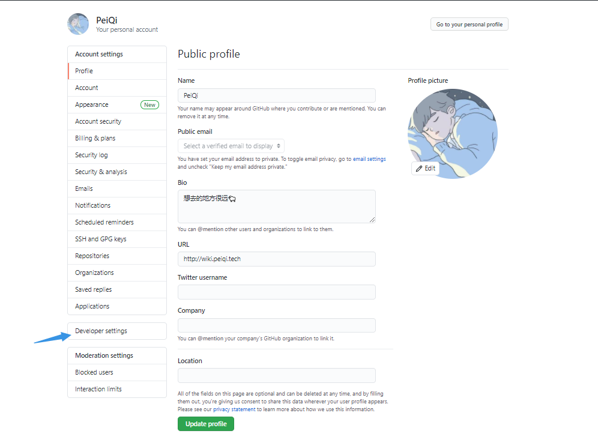
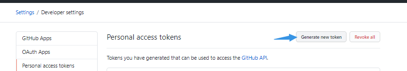
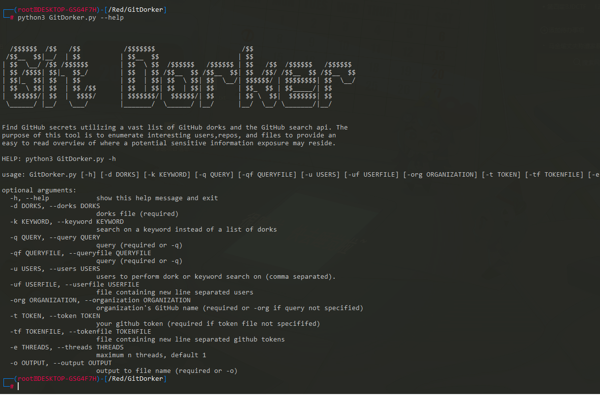
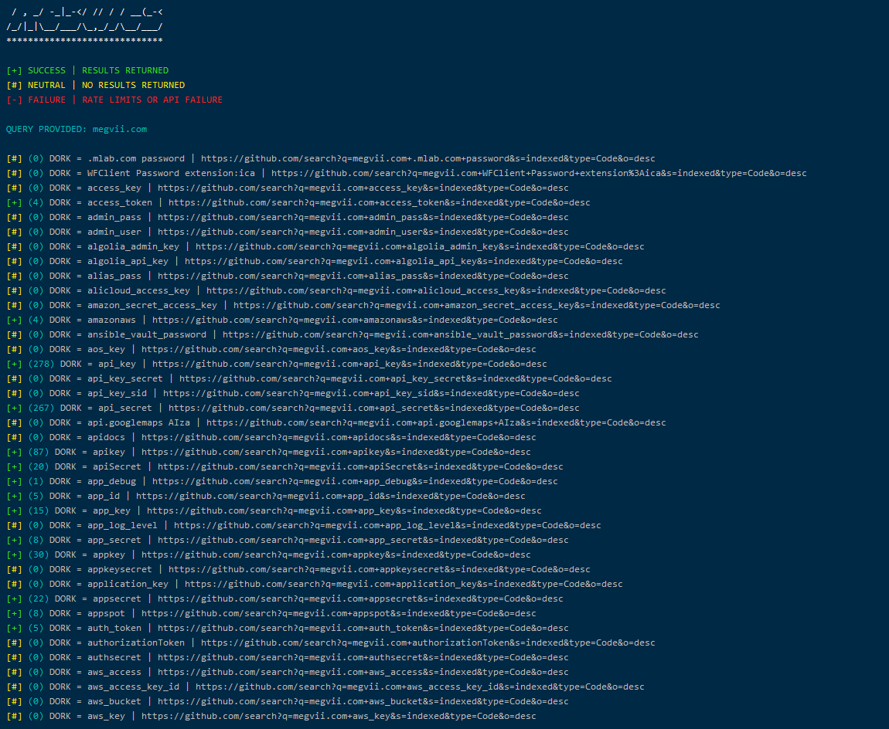

# GitDocker

## 工具地址

https://github.com/obheda12/GitDorker

## 工具简介



GitDorker是一个工具，它利用GitHub Search API和我从各种来源编译来的GitHub dork的广泛列表来提供给定搜索查询下github上存储的敏感信息的概述。

GitDorker的主要目的是为用户提供一个干净且量身定制的攻击面，以开始在GitHub上收集敏感信息。GitDorker可以与其他工具（例如有趣的存储库上的GitRob或Trufflehog）一起使用，或从GitDorker发现的用户使用以产生最佳效果

其中还有速率限制功能 ，GitDorker利用GitHub搜索API，每分钟最多只能请求30个请求。为了防止速率限制，每30个请求后，GitDorker就会内置一个睡眠功能以防止搜索失败。因此，如果要运行带有GitDorker的alldorks.txt文件，该过程大约需要5分钟才能完成。

## 工具使用

```shell
git clone https://github.com/obheda12/GitDorker.git
cd GitDorker
pip3 install -r requirements.txt
```

因为是调用API接口，所以还需要在Github创建凭据





创建后将凭据添加入文件 **tf/TOKENSFILE** 中

> [!NOTE]
>
> 多个凭据可以让搜索时间减少



常常使用的方法

```python
python3 GitDorker.py -tf tf/TOKENSFILE -q baidu.com -d Dorks/alldorksv3 -o data.txt
```

```
-q 第一关键字，大部分写为:qq.com baidu.com域名方式
-d 第一关键词	   搜索-d指定的文件中的关键词
-e 线程
-o 输出文件
```

使用内置的大文件搜索结果如图，时间大概 8分钟左右

> [!NOTE]
>
> 可以根据自己的需求自定义字典快速找到突破口

