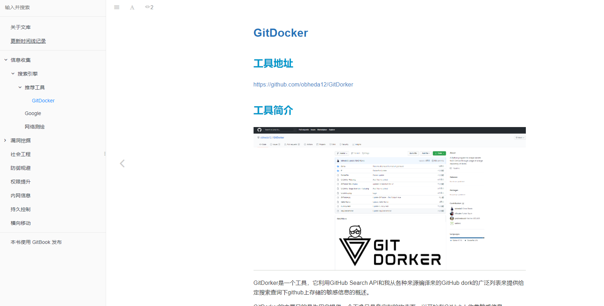
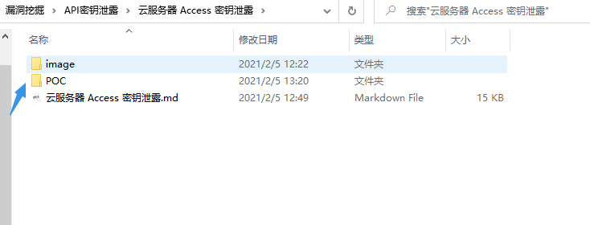

# PeiQi  WiKi-RED文库🐑

## 关于文库

这个文库用于整合互联网上关于渗透测试的资料和技巧，与 [PeiQI  WiKi-POC文库](http://wiki.peiqi.tech) 相似，PeiQI  WiKi-RED文库 同样也是开源面向所有人的，大家可以随时在线翻阅或者下载本地搭建🐋

## 公众号和作者

> [!NOTE]
>
> 更新的文章都会在第一时间推送在公众号，如果对文库有建议或者想要指出错误，可以扫一扫微信加我好友🐧

## 关于使用

文库使用的是[Gitbook](https://www.gitbook.com/)，因为风格比较清新，简洁。于是便选择了它来搭建文库。

目前Wiki文库是开源的，每一个人都可以下载随时翻阅🐬

[在线查阅](http://red.peiqi.tech)

[Github链接](https://github.com/PeiQi0/PeiQi-WIKI-RED)

[码云链接](https://gitee.com/yelisenyu/red)

> [!NOTE]
>
> 每个模块都有可用工具，有使用方法和一些技巧

> [!NOTE]
>
> 部分检测脚本放在POC目录中

## 如何本地使用

> [!NOTE]
>
> 1.Github 拉取代码
>
> git    clone    https://github.com/PeiQi0/PeiQi-WIKI-RED.git
>
> git    clone    https://github.com/PeiQi0/wiki.git
>
> ----------------------------------------------------------------------------------

> 2.下载 gitbook
>
> apt   install    npm
>
> npm   install    gitbook-cli   -g
>
> ----------------------------------------------------

> 3.打开Wiki的目录下执行
>
> gitbook   serve
>
> -----------------------------------------------------------------------------------

> 4.访问 http://localhost:4000 即可

> 也可以将 _book 作为网站根目录来搭建文库(此目录为已经编译好的html格式)

## 最后

> [!NOTE]
>
> 别忘了Github下载完给个小星星⭐

