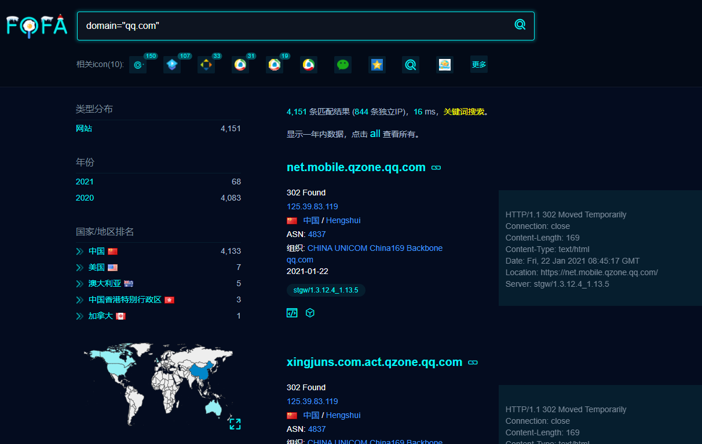
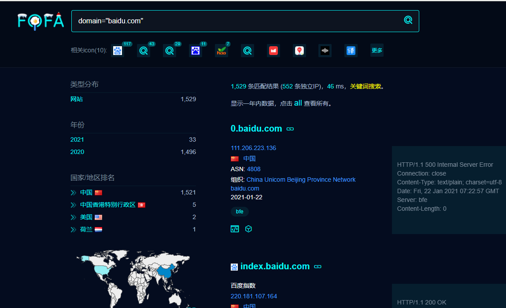
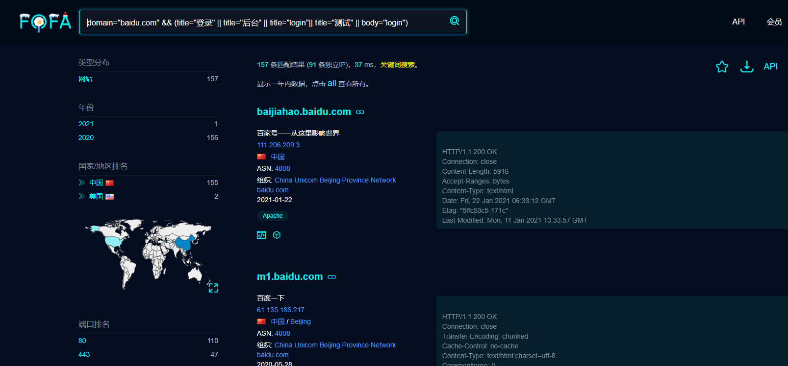
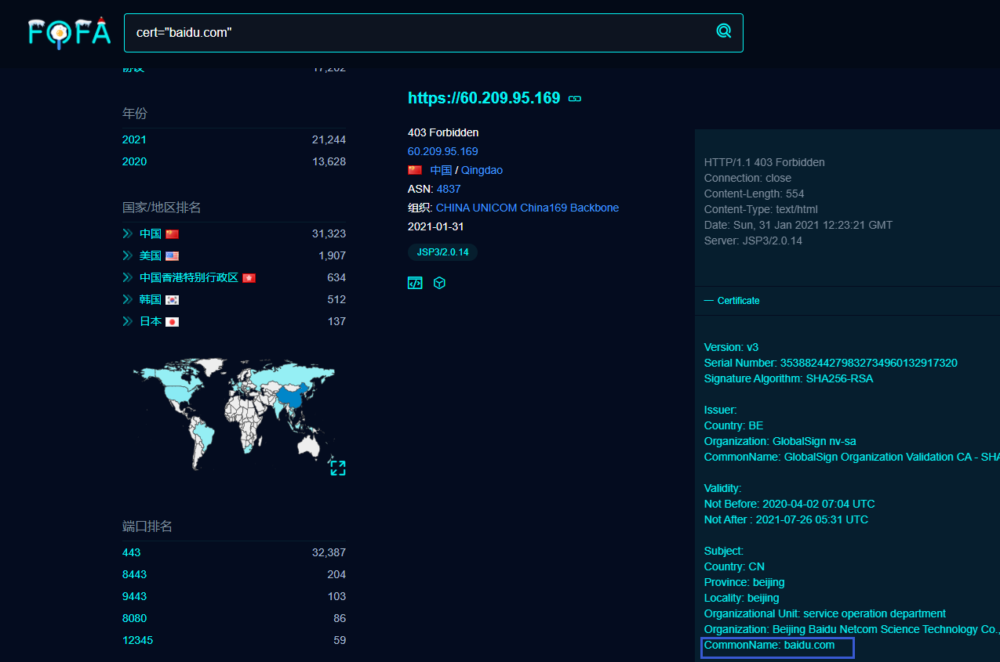
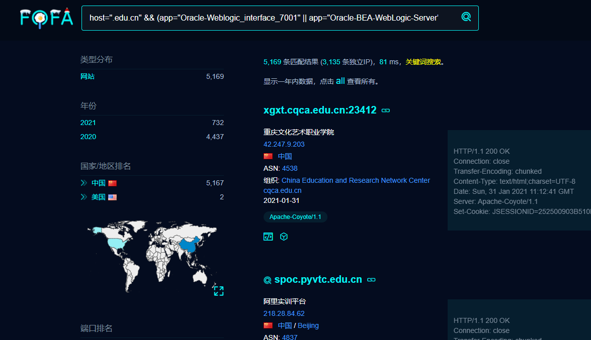

# FOFA

## 基础语法

通过标题去查找目标

**title="OA系统"**


通过搜索根域名查找子域名

**domain="qq.com"**



这里只拿部分举个例子，更多使用方法参考下表

| [title="beijing"](https://fofa.so/result?qbase64=dGl0bGU9ImJlaWppbmci) | 从标题中搜索“北京”                                 | -                                                     |
| ------------------------------------------------------------ | -------------------------------------------------- | ----------------------------------------------------- |
| [header="jboss"](https://fofa.so/result?qbase64=aGVhZGVyPSJqYm9zcyI%3D) | 从http头中搜索“jboss”                              | -                                                     |
| [body="Hacked by"](https://fofa.so/result?qbase64=Ym9keT0iSGFja2VkIGJ5Ig%3D%3D) | 从html正文中搜索abc                                | -                                                     |
| [domain="qq.com"](https://fofa.so/result?qbase64=ZG9tYWluPSJxcS5jb20i) | 搜索根域名带有qq.com的网站。                       | -                                                     |
| [icon_hash="-247388890"](https://fofa.so/result?qbase64=aWNvbl9oYXNoPSItMjQ3Mzg4ODkwIg%3D%3D) | 搜索使用此icon的资产。                             | 仅限高级会员使用                                      |
| [host=".gov.cn"](https://fofa.so/result?qbase64=aG9zdD0iLmdvdi5jbiI%3D) | 从url中搜索”.gov.cn”                               | 搜索要用host作为名称                                  |
| [port="443"](https://fofa.so/result?qbase64=cG9ydD0iNDQzIg%3D%3D) | 查找对应“443”端口的资产                            | -                                                     |
| [ip="1.1.1.1"](https://fofa.so/result?qbase64=aXA9IjEuMS4xLjEi) | 从ip中搜索包含“1.1.1.1”的网站                      | 搜索要用ip作为名称                                    |
| [ip="220.181.111.1/24"](https://fofa.so/result?qbase64=aXA9IjIyMC4xODEuMTExLjEvMjQi) | 查询IP为“220.181.111.1”的C网段资产                 | -                                                     |
| [status_code="402"](https://fofa.so/result?qbase64=c3RhdHVzX2NvZGU9NDAy) | 查询服务器状态为“402”的资产                        | -                                                     |
| [protocol="https"](https://fofa.so/result?qbase64=cHJvdG9jb2w9Imh0dHBzIg%3D%3D) | 查询https协议资产                                  | 搜索指定协议类型(在开启端口扫描的情况下有效)          |
| [city="Hangzhou"](https://fofa.so/result?qbase64=Y2l0eT0iSGFuZ3pob3Ui) | 搜索指定城市的资产。                               | -                                                     |
| [region="Zhejiang"](https://fofa.so/result?qbase64=cmVnaW9uPSJaaGVqaWFuZyI%3D) | 搜索指定行政区的资产。                             | -                                                     |
| [country="CN"](https://fofa.so/result?qbase64=Y291bnRyeT0iQ04i) | 搜索指定国家(编码)的资产。                         | -                                                     |
| [cert="google"](https://fofa.so/result?qbase64=Y2VydD0iZ29vZ2xlIg%3D%3D) | 搜索证书(https或者imaps等)中带有google的资产。     | -                                                     |
| [banner=users && protocol=ftp](https://fofa.so/result?qbase64=YmFubmVyPXVzZXJzICYmIHByb3RvY29sPWZ0cA%3D%3D) | 搜索FTP协议中带有users文本的资产。                 | -                                                     |
| [type=service](https://fofa.so/result?qbase64=dHlwZT1zZXJ2aWNl) | 搜索所有协议资产，支持subdomain和service两种。     | 搜索所有协议资产                                      |
| [os=windows](https://fofa.so/result?qbase64=b3M9d2luZG93cw%3D%3D) | 搜索Windows资产。                                  | -                                                     |
| [server=="Microsoft-IIS/7.5"](https://fofa.so/result?qbase64=c2VydmVyPT0iTWljcm9zb2Z0LUlJUy83LjUi) | 搜索IIS 7.5服务器。                                | -                                                     |
| [app="HIKVISION-视频监控"](https://fofa.so/result?qbase64=YXBwPSJISUtWSVNJT04t6KeG6aKR55uR5o6nIg%3D%3D) | 搜索海康威视设备                                   | -                                                     |
| [after="2017" && before="2017-10-01"](https://fofa.so/result?qbase64=YWZ0ZXI9IjIwMTciICZhbXA7JmFtcDsgYmVmb3JlPSIyMDE3LTEwLTAxIg%3D%3D) | 时间范围段搜索                                     | -                                                     |
| [asn="19551"](https://fofa.so/result?qbase64=YXNuPSIxOTU1MSI%3D) | 搜索指定asn的资产。                                | -                                                     |
| [org="Amazon.com, Inc."](https://fofa.so/result?qbase64=b3JnPSJBbWF6b24uY29tLCBJbmMuIg%3D%3D) | 搜索指定org(组织)的资产。                          | -                                                     |
| [base_protocol="udp"](https://fofa.so/result?qbase64=YmFzZV9wcm90b2NvbD0idWRwIg%3D%3D) | 搜索指定udp协议的资产。                            | -                                                     |
| [is_ipv6=true](https://fofa.so/result?qbase64=aXNfaXB2Nj10cnVl) | 搜索ipv6的资产                                     | 搜索ipv6的资产,只接受true和false。                    |
| [is_domain=true](https://fofa.so/result?qbase64=aXNfZG9tYWluPXRydWU%3D) | 搜索域名的资产                                     | 搜索域名的资产,只接受true和false。                    |
| [ip_ports="80,161"](https://fofa.so/result?qbase64=aXBfcG9ydHM9IjgwLDE2MSI%3D) | 搜索同时开放80和161端口的ip                        | 搜索同时开放80和161端口的ip资产(以ip为单位的资产数据) |
| [port_size="6"](https://fofa.so/result?qbase64=cG9ydF9zaXplPSI2Ig%3D%3D) | 查询开放端口数量等于"6"的资产                      | 仅限FOFA会员使用                                      |
| [port_size_gt="3"](https://fofa.so/result?qbase64=cG9ydF9zaXplX2d0PSIzIg%3D%3D) | 查询开放端口数量大于"3"的资产                      | 仅限FOFA会员使用                                      |
| [port_size_lt="12"](https://fofa.so/result?qbase64=cG9ydF9zaXplX2x0PSIxMiI%3D) | 查询开放端口数量小于"12"的资产                     | 仅限FOFA会员使用                                      |
| [ip_country="CN"](https://fofa.so/result?qbase64=aXBfY291bnRyeT0iQ04i) | 搜索中国的ip资产(以ip为单位的资产数据)。           | 搜索中国的ip资产                                      |
| [ip_region="Zhejiang"](https://fofa.so/result?qbase64=aXBfcmVnaW9uPSJaaGVqaWFuZyI%3D) | 搜索指定行政区的ip资产(以ip为单位的资产数据)。     | 搜索指定行政区的资产                                  |
| [ip_city="Hangzhou"](https://fofa.so/result?qbase64=aXBfY2l0eT0iSGFuZ3pob3Ui) | 搜索指定城市的ip资产(以ip为单位的资产数据)。       | 搜索指定城市的资产                                    |
| [ip_after="2019-01-01"](https://fofa.so/result?qbase64=aXBfYWZ0ZXI9IjIwMTktMDEtMDEi) | 搜索2019-01-01以后的ip资产(以ip为单位的资产数据)。 | 搜索2019-01-01以后的ip资产                            |
| [ip_before="2019-07-01"](https://fofa.so/result?qbase64=aXBfYmVmb3JlPSIyMDE5LTA3LTAxIg%3D%3D) | 搜索2019-07-01以前的ip资产(以ip为单位的资产数据)。 | 搜索2019-07-01以前的ip资产                            |

## 目标信息收集

子域名收集



通过图标hash搜索


添加关键字查询资产



使用证书查找资产



搜索常见漏洞组件资产(Weblogic, JBoss, Struts2,Apache-Shiro)

```
host=".edu.cn" && (app="Oracle-Weblogic_interface_7001" || app="Oracle-BEA-WebLogic-Server" || title=="Error 404--Not Found" || app="JBoss" || app="Struts2" || app="Apache-Shiro" || title="OA" )
```



FOFA还有很多用法可以自行探索